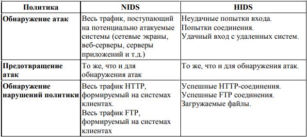

# Московский Политех

**Факультет информационных технологий**  
**Кафедра информационной безопасности**


---

## Индивидуальное вариативное задание

**Тема:** Требования и примерный алгоритм внедрения IDS


**Выполнил:** студент группы 241-371 Вожаков М.А.  
**Руководитель:** Кесель С.А., к.т.н., доцент кафедры ИБ


**Место выполнения:** лаборатория «Программно-аппаратных средств обеспечения информационной безопасности»  
**Год:** 2025

---

<div align="center">

МИНИСТЕРСТВО НАУКИ И ВЫСШЕГО ОБРАЗОВАНИЯ  
РОССИЙСКОЙ ФЕДЕРАЦИИ  
Федеральное государственное автономное образовательное учреждение высшего образования  
«МОСКОВСКИЙ ПОЛИТЕХНИЧЕСКИЙ УНИВЕРСИТЕТ»  
**МОСКОВСКИЙ ПОЛИТЕХ**  
ФАКУЛЬТЕТ ИНФОРМАЦИОННЫХ ТЕХНОЛОГИЙ  
КАФЕДРА «ИНФОРМАЦИОННАЯ БЕЗОПАСНОСТЬ»  

<br>

### ИНДИВИДУАЛЬНОЕ ВАРИАТИВНОЕ ЗАДАНИЕ  
**На тему:**  
## «Требования и примерный алгоритм внедрения IDS»  

</div>

**Выполнил:** ст. гр. 241-371 Вожаков М. А.


Руководитель: Кесель С. А., к.т.н., доцент кафедры «Информационная безопасность»

Место проведения: Московский Политех, лаборатория «Программно-аппаратных средств обеспечения информационной безопасности»
<div align="center">
Москва – 2025
</div>

## Содержание

- [ВВЕДЕНИЕ](#введение)

- [ГЛАВА 1. АНАЛИТИЧЕСКАЯ ЧАСТЬ](#глава-1-аналитическая-часть)

- [ГЛАВА 2. ПРАКТИЧЕСКАЯ ЧАСТЬ](#глава-2-практическая-часть)

- [ВЫВОД](#вывод)

- [СПИСОК ИСПОЛЬЗУЕМЫХ ИСТОЧНИКОВ](#список-используемых-источников)

## ВВЕДЕНИЕ


Учебная практика по теме «Требования и примерный алгоритм внедрения IDS», выполненная Вожаковым Михаилом, ст. гр. 241-371, включает в себя изучение систем обнаружения вторжений, их архитектуры, методов работы и типов решений, формирование типовых требований к IDS для малой организации, разработку примерного алгоритма внедрения, а также практическую установку и тестирование учебной IDS в виртуальной среде.

Цель учебной практики — получить новые знания и практические навыки в области информационной безопасности, изучив виды и принципы работы IDS, их внедрение в малой организации, и продемонстрировать их применение на практике.

Для достижения поставленной цели поставлены и решены следующие задачи:

Изучение предметной области (архитектуры, назначения и типы IDS);

Сравнительный анализ сетевых и хостовых IDS;

Формулировка типовых требований к IDS для малой организации;

Разработка алгоритма внедрения IDS в IT-инфраструктуру;

Установка и настройка учебной IDS (Snort);

Тестирование IDS и фиксация типовых событий.

Объектом исследования является информация о IDS, система обнаружения вторжений Snort.


## ГЛАВА 1. АНАЛИТИЧЕСКАЯ ЧАСТЬ


Общая информация о IDS

Для лучшего понимания определения IDS обозначим несколько понятий из области информационной безопасности (далее – ИБ).

Обнаружение вторжений —

процесс выявления несанкционированного доступа (или попыток несанкционированного доступа) к ресурсам автоматизированной системы;

задача, выполняемая при обеспечении защиты от атак, представляющая собой активный процесс, при котором происходит обнаружение хакера при его попытках проникнуть в систему.

Система обнаружения вторжений (Intrusion Detection System, IDS) —

в общем случае представляет собой программно-аппаратный комплекс, выполняющий процесс «обнаружение вторжений».

Концепция IDS заключается в необходимости определения периметра защиты компьютерной системы или сети.

Периметр защиты сети —

виртуальный периметр, внутри которого находятся компьютерные системы и способный определяться межсетевыми экранами, точками разделения соединений или настольными компьютерами с модемами.

Система обнаружения вторжений выступает аналогом сигнализации внутри такого периметра, IDS анализирует поведение пользователей, системных компонентов и (или) сетевого трафика с целью своевременного обнаружения угроз для информации

Назначение IDS:

Непрерывное обеспечение контроля за событиями в информационной системе или сети;

непрерывное наблюдение за действиями пользователей, процессами, сетевыми соединениями и трафиком с целью своевременного выявления отклонений от нормы

Раннее выявление атак и попыток нарушения политики безопасности соединений;

поиск определённых признаков вторжения

Предотвращение атак и нейтрализация угроз;

выполнение активных действий

Обнаружение нарушений политики соединений;

выявление отклонений от политик организации

Принудительное обеспечение соблюдения политики соединений;

Использования принудительного блокирования незапрошенных или запрещенных соединений

Сбор цифровых доказательств;

настройка на отслеживание определенных соединений и ведение полноценного журнала по учету трафика для сбора информации после инцидента

Снижение времени реакции на инциденты.

Уменьшает время от момента возникновения угрозы до момента реагирования на нее

IDS может выполнять следующие функции:

Мониторинг сетевого трафика и (или) активности хостов;

Обнаружение атак и вредоносных действий;

Обнаружение нарушений и принуждение к следованию политике соединений;

Сбор и корреляция событий;

Регистрация и хранение событий (логгирование);

Уведомление администратора (или аналитика ИБ);

Интеграция с другими средствами защиты.

Архитектура IDS


Типичная архитектура IDS включает в себя следующие компоненты:

Сенсоры (или датчики) — представляют собой модули, обеспечивающие сбор информации (сетевого трафика, журналов, системных вызовов и др.);

Ядро (модуль анализа) — обрабатывает поступающие данные, выявляет аномалии и признаки атак;

База сигнатур — содержит известные шаблоны атак, используемые для сигнатурного анализа;

Модуль протоколирования — сохраняет события в журнал для последующего анализа;

Модуль ответного реагирования — реализует меры по устранению угроз (например, блокировка IP-адреса);

Консоль управления — интерфейс для администратора, где отображаются события и принимаются решения.

В архитектуре сетевой IDS (NIDS) особую роль играет сетевой интерфейс, который используется для перехвата всего сетевого трафика, проходящего через определённый сегмент сети.


Взаимодействие компонентов в IDS реализуется по следующему алгоритму:

Сенсор получает перехваченный сетевой пакет;

Пакет поступает в модуль анализа;

Система проверяет его на соответствие в базе сигнатур;

При совпадении — происходит регистрация и оповещение;

Вызов ответной реакции (если это установлено в системе).

1.3 Сравнение сетевых (NIDS) и хостовых (HIDS) систем обнаружения вторжений

Существуют две основных категории систем IDS:

Узловая IDS (Host intrusion detection system - HIDS) — это система обнаружения вторжений, устанавливаемая непосредственно на защищаемый хост (сервер, рабочую станцию).  Состоит из системы датчиков, отслеживающих различные типы событий и предпринимающих определенные действия на сервере либо передающих уведомления, при это они работаю в пределах платформы, на которой установлены датчики.

Сетевая IDS (Network intrusion detection system - NIDS) — это система обнаружения вторжений, предназначенная для анализа сетевого трафика в реальном времени. Устанавливается на выделенном системе в сети и работает через сетевой интерфейс в режиме мониторинга, перехватывая и анализируя весь проходящий через сеть трафик.

Существует пять основных типов датчиков HIDS:

Анализаторы журналов — отслеживают записи журналов, которые могут означать событие, связанное с безопасностью системы.

Датчики признаков — сопоставляют признаки, обеспечивают возможность отслеживания атак во время их выполнения в системе.

Анализаторы системных вызовов — осуществляют анализ вызовов между приложениями и операционной системой для идентификации событий, связанных с безопасностью.

Анализаторы поведения приложений — проверяет вызов на предмет того, разрешено ли приложению выполнять данное действие.

Контролеры целостности файлов — отслеживают изменения в файлах.

Проведем сравнение решений с помощью таблицы «Сравнительный анализ HIDS и NIDS»

Основным типом датчиков для NIDS являются сенсоры сетевого трафика с сигнатурным или поведенческим анализом


### Таблица 1.1 Сравнительный анализ HIDS и NIDS

| **Критерий**                        | **HIDS**                                                                                                                                         | **NIDS**                                                                                                                                                                |
|-------------------------------------|--------------------------------------------------------------------------------------------------------------------------------------------------|--------------------------------------------------------------------------------------------------------------------------------------------------------------------------|
| **Место установки**                | На конкретном хосте (или сервере)                                                                                                                | На выделенной системе внутри защищаемого сегмента сети                                                                                                                    |
| **Объект мониторинга**             | События в пределах платформы (на уровне ОС)                                                                                                     | Весь сетевой трафик, проходящий через сетевой интерфейс                                                                                                                   |
| **Особенности обнаружения**       | Может определять исход вторжения  
Эффективна для анализа внутренней активности и инцидентов  
Проблемы с определением успешности атаки       | Эффективна для обнаружения атак в «данный момент»                                                                                                                         |
| **Используемые датчики**           | Анализаторы журналов, датчики признаков, анализаторы системных вызовов, поведения приложений, контролеры целостности файлов                    | Сенсоры сетевого трафика с сигнатурным или поведенческим анализом                                                                                                         |
| **Преимущества**                   | Усиленный контроль действий и процессов на узле  
Возможность работы без подключения к сети                                                    | Возможность скрытности  
Мониторинг множества целей  
Перехват содержимого пакетов                                                                                      |
| **Недостатки**                     | Требуется установка на каждый узел  
Повышенная нагрузка на систему  
Может быть отключена злоумышленником                                    | Возможен пропуск трафика  
Невозможность анализа зашифрованного трафика  
Нужна спец. настройка в коммутируемых сетях                                                  |
| **Реакция на инцидент**           | Ведение журнала, уведомление, блокировка действий                                                                                               | Уведомление, регистрация события                                                                                                                                        |
| **Подходит для**                   | Критически важных серверов, рабочих станций с чувствительной информацией                                                                         | Периферийных узлов сети, точек доступа, межсетевых экранов, шлюзов                                                                                                       |


На основе данных из таблицы сделаем вывод:

HIDS является лучшим выбором для сети, состоящей из одного или нескольких устройств; подходит для детального анализа, более качественного внутреннего контроля и сбора информации для инцидентов.

NIDS является хорошим выбором для крупной сети; отслеживания трафика в реальном времени подходит для мониторинга сетевых атак и общей сетевой активности.

1.4 Требования к IDS для малой организации

При формировании требований к IDS для малых организаций важно учитывать особенности их инфраструктуры. Такими особенностями являются объем и характер защищаемых ресурсов, а также возможные потенциальные угрозы.

Пункт 1. Установим объекты, которые необходимо защитить:

Серверы (файловые, почтовые, веб, БД);

Рабочие станции сотрудников (особенно с доступом к критичным данным);

Маршрутизаторы и точки доступа Wi-Fi;

Устройства в DMZ (если организация предоставляет онлайн-доступ к своим сервисам).

Пункт 2. Определим события, которые будем отслеживать на основе рисунка 1.3:

Обнаружение атак:

неудачные попытки входа;

сканирование портов;

соединения с подозрительными адресами;

передачи подозрительных файлов

Попытки подбора паролей:

множественные неуспешные логины;

активность в нестандартное время;

Обращения к вредоносным или запрещённым ресурсам:

HTTP/FTP трафик на запрещённые сайты;

загрузка исполняемых файлов из сети.

Нарушения политики безопасности:

использование внешних VPN;

попытки запуска неразрешённого ПО;

подключение к USB-носителям (для HIDS).

Необычная активность на хостах:

изменение системных файлов;

запуск неизвестных процессов;

повышение привилегий пользователем


Пункт 3. При формировании требований стоит учесть бюджет организации, поэтому проанализируем статистику по решениям и их ценам с сайта CIO Insight Hub (данные с сайта приведены в Таблице 1.2).

На основе данных таблицы можно сделать вывод, что лучшими вариантами будут постоянные лицензии или подписки. Для организации с небольшим бюджетом они станут доступным вариантом, соблюдающим баланс между стоимостью и функциональностью.

Таблица 1.2. Цены на IDS-решения по данным CIO Insight Hub (2024)

Пункт 4. На следующем этапе определимся с перечнем ответных действий, которые будет выполнять наша система (оформим в виде Таблицы 1.3).

Таблица 1.3.Ответные действия IDS

Пункт 5. Учтем некоторые особенности:

Простота установки и настройки (малое количество или отсутствие специалистов);

Возможность работы в фоновом режиме без сильной нагрузки (при HIDS);

Совместимость с текущей инфраструктурой;

Наличие шаблонов правил и автоматических обновлений (для облегчения эксплуатации);

Подведем итог, для корректной работы и выполнения всех необходимых для малой организации функций должны выполняться пункты 1-5.

1.5 Разработка алгоритма внедрения IDS

Для оптимизации рабочего процесса необходимы документы или другие источники, где подробно расписаны действия работника в той или иной ситуации. При работе с IDS особое внимание необходимо уделять алгоритму ее внедрения в систему организации.

1. Анализ текущей инфраструктуры

Любое изменение инфраструктуры безопасности должно начинаться с ее анализа. Это может быть аудит защищаемых объектов, включая серверы, точки доступа, маршрутизаторы, рабочие станции и периферию; выявление узлов критической важности и каналов, через которые возможен несанкционированный доступ; анализ наличия сетевого оборудования, межсетевых экранов, журналов безопасности, используемых ОС и архитектуры сети; определение перечня потенциальных угроз.

Результатом этой работы должно быть знание следующих пунктов:

Необходимость внедрения;

Возможность внедрения (финансовая, аппаратная и т.д.);

Промежуточные и итоговые цели внедрения IDS.

2. Постановка задач, требований, подхода к защите

Следующим этапом является постановка задач, определение требований и выбор подхода к защите.

Сюда будут включены следующие задачи:

Определение целей мониторинга;

Выбор решения (HIDS, NIDS);

Определение требуемых реакций на события;

Определение перечня полного требований для IDS.

3. Создание тестовой среды

Перед окончательным выбором IDS необходимо сравнить предлагаемые рынком варианты (информационные ресурсы о ПО и, по возможности, практические результаты).

4. Приобретение, установка и первичная настройка

После приобретения подходящего под нужды продукта необходимо провести его установку с нужными зависимостями и провести базовую настройку, например:

Сетевого интерфейса;

Переменной HOME_NET;

Пути к правилам;

Директории логов;

И т.д.

После чего активировать сигнатуры по типовым атакам.

5. Углубленная настройка и тестирование работы

Задачи данного этапа:

Добавление правил;

Тестирование срабатывания обнаружения;

Корректировка (при необходимости);

Повторное тестирование.

6. Анализ журнала событий и оценка эффективности

На данном этапе необходимо подвести итог о работе IDS и проверить систему на соответствие стандартам.

Задачи данного этапа:

Провести оценку по следующим примерным критериям: какие атаки могут быть обнаружены, наличие ложных срабатываний, выполнились ли поставленные цели.

Проведение работ по определению соответствию работы системы регламентирующим стандартам.

При возникновении каких-то проблем (несоответствие стандартам, слишком маленький охват и т.д.) необходимо повторить пункты 1-5.

7. Обучение персонала

Задачи данного этапа:

Проведение инструктажа;

Разработка инструкций и регламентов реагирования;

Наем новых работников и (или) увольнение старых (при необходимости) – это не личная возможность или обязанность специалиста, но при необходимости, специалист может запросить выполнение этой задачи руководством.

8. Внедрение в рабочую среду

Задачи данного этапа:

Постепенная интеграция IDS в сеть;

Организация резервного копирования;

Проведение аудита, технических работ, переоценки инфраструктуры, обновления IDS;

Установление взаимодействия с другими системами защиты.

Внедрение системы обнаружения вторжений (IDS) по данному алгоритму позволит уменьшить риски возникновения инцидентов, связанных с IDS, а также повысить общую благонадежность системы защиты.


## ГЛАВА 2. ПРАКТИЧЕСКАЯ ЧАСТЬ


2.1 Общие сведения

Для закрепления знаний о IDS установим и протестируем на виртуальной маши не учебную систему обнаружения вторжений Snort.

Snort — это популярная система обнаружения (IDS), разработанная компанией Cisco. Она предназначена для мониторинга сетевого трафика в реальном времени и обнаружения различных видов атак, включая сканирование портов, попытки эксплуатации уязвимостей, передачи вредоносных файлов и другие формы подозрительной активности.

Краткая характеристика на основе документации:

Тип:

Сетевая ID;

Методы обнаружения:

Сигнатурный анализ (по шаблонам атак);

Аномальный (ограниченно, с помощью расширений);


## Вывод тревог:


в консоль;

лог-файл;

базы данных;

интеграция с SIEM;

Расширяемость:

Поддержка модулей и плагинов;

Совместимость:

Linux;

Windows;

macOS.

2.2 Установка IDS Snort на ВМ

Распишем по шагам этапы выполнения работы.

Шаг 1. Обновление ОС Ubuntu

В терминале введем команду

```bash
sudo apt update && sudo apt upgrade –y
```

для обновления системы.

Шаг 2. Установка зависимости (Рисунок 2.1)

Введем в терминале команду

```bash
sudo apt install snort –y
```

для установки ПО Snort.

При установке выбираем сетевой интерфейс: enp03s (по выбору).

Шаг 3. Проверка целостности файлов (Рисунок 2.2)

Проверим успешность установки и версию Snort.

```bash
snort –V
```

Шаг 4. Запуск Snort в тестовом режиме (Рисунок 2.3)

Через терминал запускаем IDS для проверки работоспособности.

```bash
sudo snort -T -c /etc/snort/snort.conf
```




2.3 Настройка IDS

Для корректной работы IDS необходимо убедиться в корректности путей, настроить базовые правила, а также набор правил, по которым будет происходить сканирование системы на вторжения.

Шаг 1. Проверка корректности путей к правилам и логам

Заходим в файл конфигурации IDS и сверяем корректность путей (в данном случае просто записываем путь, по которому сохраняется информация журнала событий).

```bash
sudo nano /etc/snort/snort.conf
```

Шаг 2. Настройка правила (Рисунок 2.4)

Перемещаемся в файл local.rules, в котором прописываются правила для обнаружения.

```bash
sudo nano /etc/snort/rules/local.rules
```

Определяем следующий набор правил:

Поиск TCP-пакетов с установленным флагом SYN (от SYN-сканирования);

Определение скачивания .exe и .bat файлов через протокол http (обнаружение возможной загрузки вредоносного ПО);

Сканирование на добавление пользователя по SSH (обнаружение возможной попытки создания несанкционированного пользователя);

Сканирование на ошибку входа по SSH (выявление brute force);

Контроль за доступом к административной панели сайта (Раннее обнаружение попыток получения несанкционированного доступа к веб-интерфейсу);

ICMP ping (фиксация сканирования сети).

Как итог, в файл были добавлены следующие строки (Рисунок 2.5):

```snort
# 1. Сканирование портов (SYN Scan)
```

```snort
alert tcp any any -> any any (flags:S; msg:"Possible Nmap SYN Scan"; sid:1000002; rev:1;)
```

```snort
# 2. Скачивание .exe и .bat файлов
```

```snort
alert tcp any any -> any 80 (msg:"Download of executable file detected"; content:".exe"; http_uri; sid:1000003; rev:1;)
```

```snort
alert tcp any any -> any 80 (msg:"Batch file download attempt"; content:".bat"; http_uri; sid:1000004; rev:1;)
```

```snort
# 3. Команда useradd (например, при подключении через SSH)
```

```snort
alert tcp any any -> any 22 (msg:"Useradd command over SSH"; content:"useradd"; sid:1000005; rev:1;)
```

```snort
# 4. Неудачная попытка входа (поиск слова 'Failed')
```

```snort
alert tcp any any -> any 22 (msg:"Failed SSH login attempt"; content:"Failed"; sid:1000006; rev:1;)
```

```snort
# 5. Доступ к admin-панели
```

```snort
alert tcp any any -> any 80 (msg:"Attempt to access admin panel"; content:"/admin"; http_uri; sid:1000007; rev:1;)
```

```snort
# 6. ICMP ping
```

```snort
alert icmp any any -> any any (msg:"ICMP Ping Detected"; sid:1000001; rev:1;)
```


2.4 Генерация тестовых событий

Шаг 1. Подготовка (Рисунок 2.6)

Определяем IPv4-адрес сетевого интерфейса.

```bash
ip –br a
```


Адрес интерфейса:

192.168.17.147

Шаг 2. Запускаем Snort (Рисунок 2.7)

Производим запуск Snort для начала мониторинга

```bash
sudo snort -A console -q -c /etc/snort/snort.conf -i enp0s3
```

Шаг 3. Тестирование

На другой ВМ начинаем вводить команды для тестирования IDS (Рисунки 2.8 и 2.9).

Сканирование портов

```bash
sudo nmap -sS 192.168.17.147
```

HTTP-запрос

```bash
curl http:// 192.168.17.147/test.exe
```

Попытка подбора SSH

```bash
hydra -l root -P /usr/share/wordlists/rockyou.txt ssh://192.168.17.147
```

Ручное добавление пользователей

```bash
sudo useradd waringuser
```

Симуляция ICMP-атаки

```bash
hping3 -1 -c 10 192.168.17.147
```

Попытка входа с неправильным паролем

```bash
ssh wronguser@192.168.17.147 413254125
```

Доступ к админ панели

```bash
curl http:// 192.168.17.147 /admin
```

Эхо-запрос

```bash
ping 192.168.17.147
```


Шаг 4. Просмотр результатов (Рисунок 3.10)

Просматриваем зафиксированные события. Все наши действия были обнаружены IDS, зафиксированы и выведены в виде уведомлений в терминале.

Также можно просмотреть журнал событий, с помощью команды

```bash
sudo cat /var/log/snort/alert
```


После анализа полученных результатов установим, что у каждого из произведенных событий были задокументированы следующие параметры:

Тип события

Время

IP-источника и назначения (инициатора события и системы)

Примененное правило

2.5 Итог

В ходе практической части была проведена установка, настройка и тестирование системы обнаружения вторжений Snort. Полученные результаты подтверждают, что Snort является эффективным инструментом для выявления сетевых угроз в реальном времени.

В процессе эксперимента Snort успешно обнаруживал:

ICMP-запросы (ping);

Сканирование портов с помощью nmap;

Попытки загрузки исполняемых файлов (.exe, .bat);

Попытки доступа к административным страницам веб-приложения;

Команды, связанные с администрированием системы (useradd);

Неудачные попытки входа по SSH.

Такой широкий спектр возможностей говорит о пригодности применения IDS Snort в реальной инфраструктуре.

Проведенное тестирование подтвердило эффективность IDS в системе организации и ее значимость для защиты информации и других объектов, связанных с ней.


## ВЫВОД


В ходе учебной практики мне удалось ознакомиться с принципами работы систем обнаружения вторжений (IDS) и их ролью в обеспечении информационной безопасности. Были изучены учебные материалы и документация по работе с IDS, а также выполнена практическая часть, направленная на установку, настройку и тестирование учебной системы в виртуальной среде.

На основе изученных материалов и технической документации была выполнена практическая часть, в которой реализована установка и настройка IDS (Snort) в виртуальной среде. В рамках работы был проведён анализ сетевого трафика и зафиксированы типовые инциденты безопасности, включая сканирование портов, передачу исполняемых файлов, несанкционированный доступ по SSH и сетевые запросы к административным страницам.

Практическая часть показала, что IDS являются важным компонентом системы защиты информации, обеспечивая выявление угроз в режиме реального времени и предоставляя средства для последующего анализа и реагирования.

В результате работы были получены базовые навыки:

по установке и конфигурации системы IDS;

по созданию пользовательских сигнатур обнаружения;

по интерпретации логов безопасности;

по оценке эффективности реагирования системы на типовые атаки.

Полученные знания и опыт подтверждают значимость IDS в общей архитектуре информационной безопасности и могут быть использованы при построении систем защиты информации в организациях, особенно в условиях малых возможностей и ограниченного бюджета (малые организации).


## СПИСОК ИСПОЛЬЗУЕМЫХ ИСТОЧНИКОВ


1. С. И. Макаренко ИНФОРМАЦИОННАЯ БЕЗОПАСНОСТЬ. - Ставрополь: СФ МГГУ им. М. А. Шолохова, 2009. - 372 с.

2. В. Л. Цирлов Основы информационной безопасности автоматизированных систем. - Ростов-на-Дону: Феникс, 2008. - 164 с.

3. Чернышов Н.А. Использование брандмауэра и IDS для обнаружения и предотвращение сетевых атак. - Самара: Поволжский государственный университет телекоммуникаций и информатики, 2023. - 7 с.

4. Конкурентный анализ систем обнаружения вторжений (IDS): выбор лучшего решения для обеспечения безопасности вашей сети // CIOHUB URL: https://ciohub.org/post/2024/04/intrusion-detection-system-ids-competitive-analysis/ (дата обращения: 15.05.2025).

5. Snort Documents // SNORT URL: https://www.snort.org/documents (дата обращения: 15.05.2025).

6. Безопасность данных с помощью IDS/IPS // @СТРАЛ БЕЗОПАСНОСТЬ URL: https://is.astral.ru/news/blog/bezopasnost-dannykh-ids-ips/ (дата обращения: 15.05.2025).
